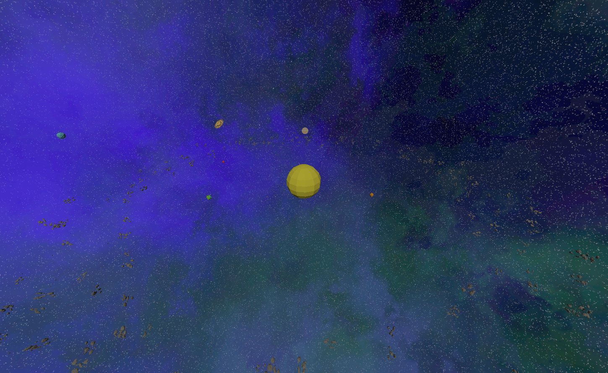
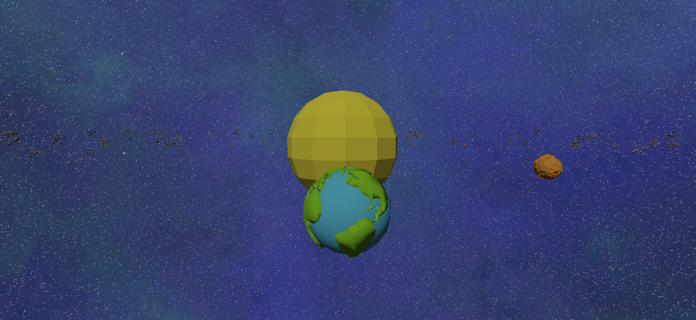
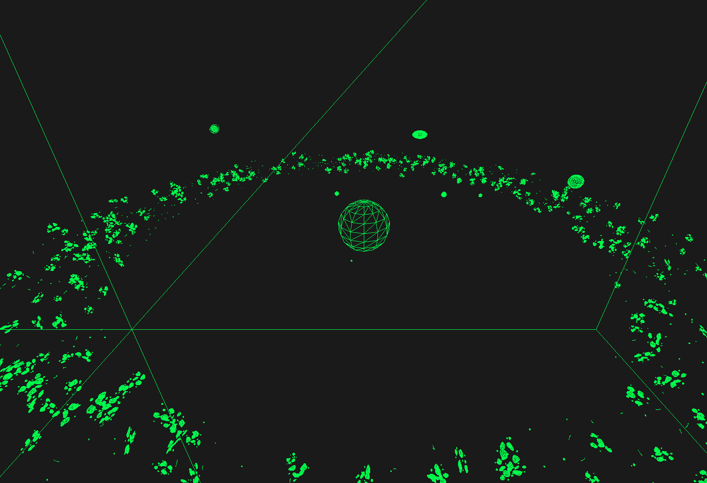
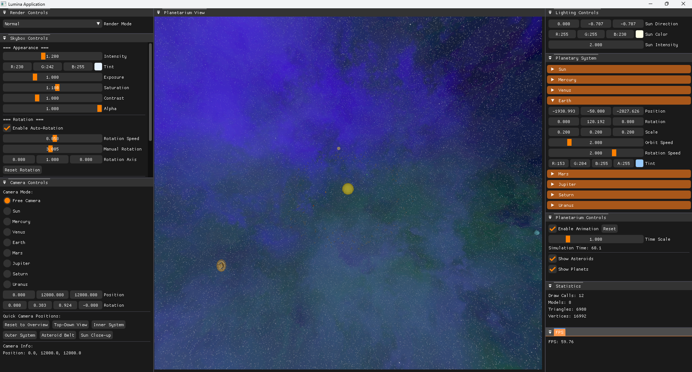
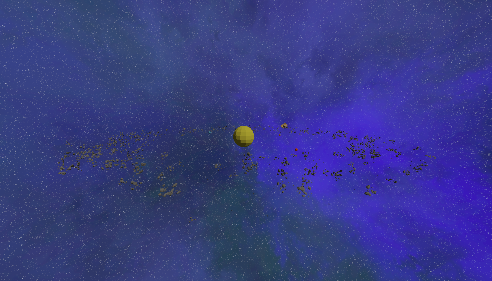
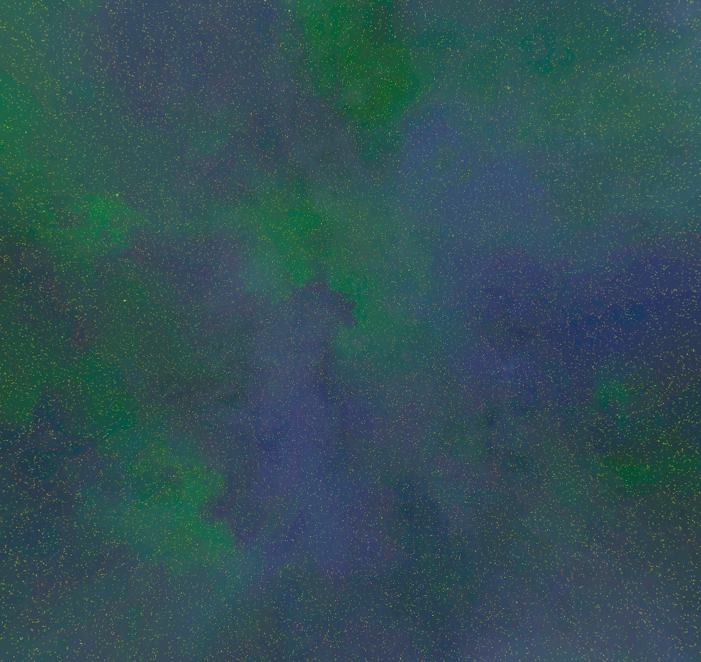
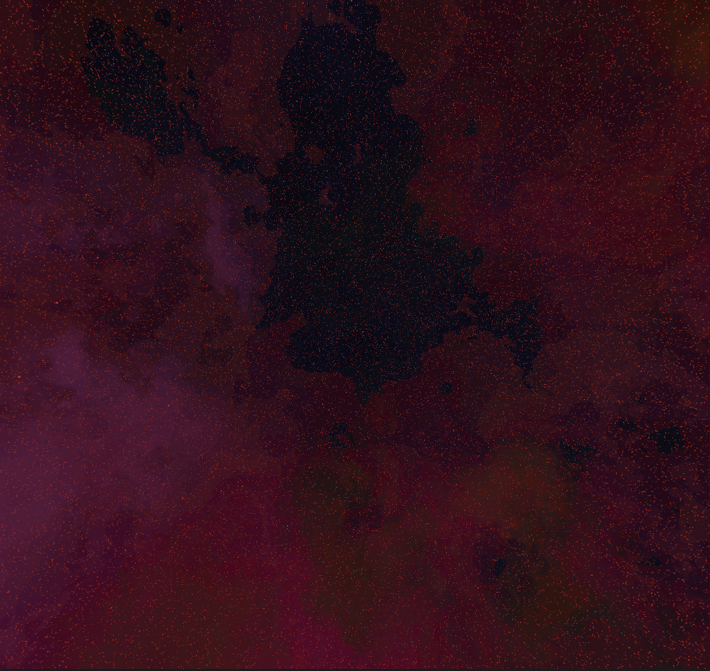
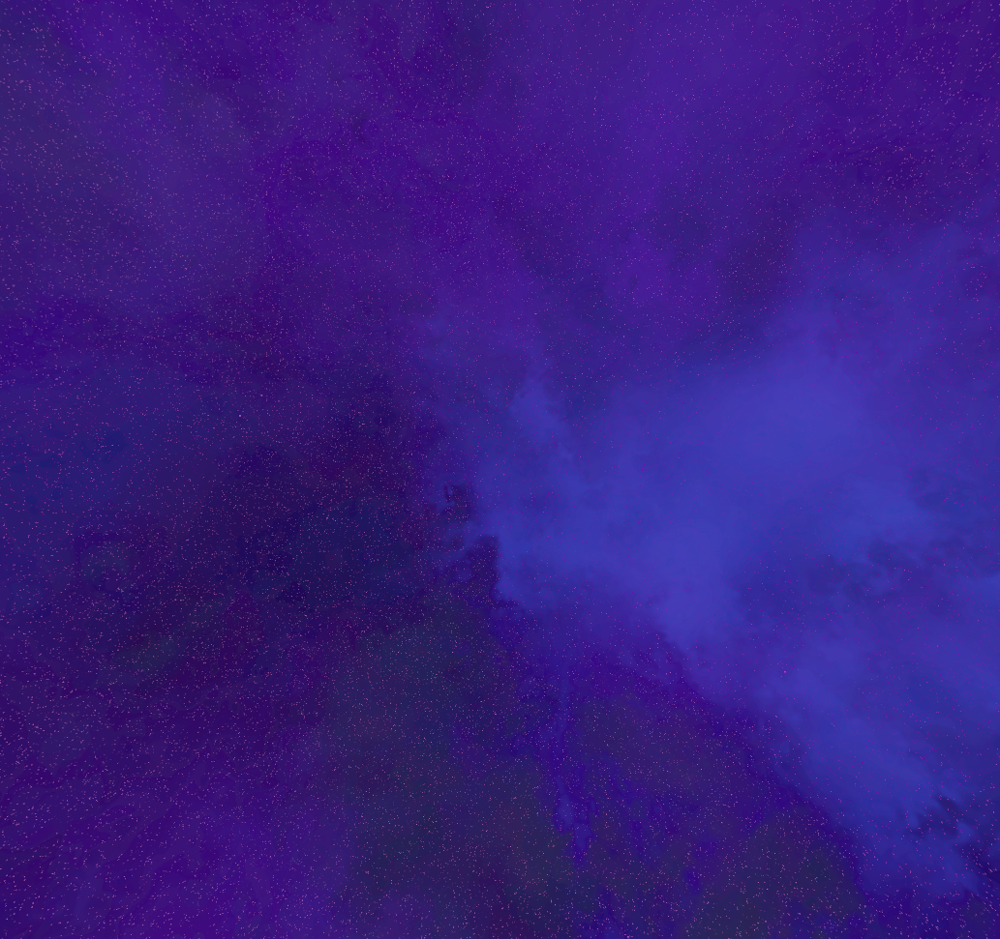
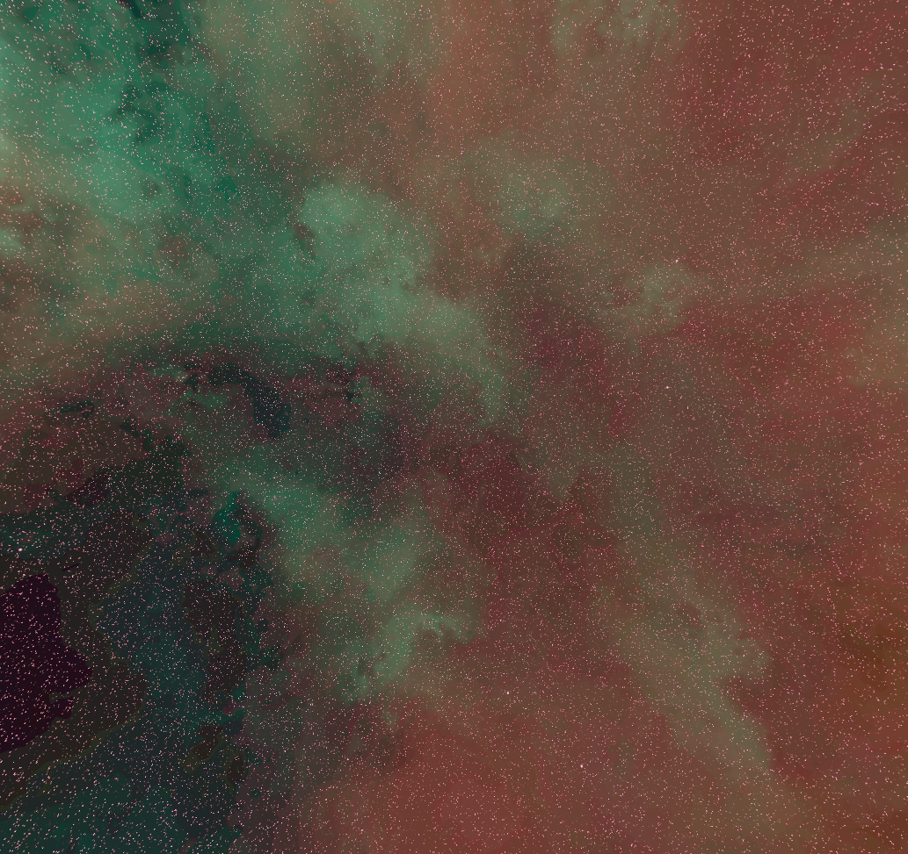

# Orbital Engine

**Orbital Engine** is a 3D solar system simulation built to demonstrate **Lumina's** latest 3D workflow capabilities. The application provides users with comprehensive control over the simulation, including the ability to adjust simulation speed, modify planetary distances, and customize skybox attributes such as rotation speed, rotation axis, color, contrast, and intensity. The simulation leverages Lumina's advanced lighting system, featuring both directional and point light rendering to create realistic celestial illumination. Built with modern OpenGL rendering techniques, the engine showcases advanced 3D graphics programming while maintaining smooth performance and intuitive user interaction.

<div align="center" style="text-align: center; margin-top: 20px; margin-bottom: 20px;">
    
    <p><em>Complete solar system view showing all planets in their orbits with realistic scaling</em></p>
</div>

## 🚀 Orbital Engine Features

✅ **Solar System Simulation** – Planetary orbits with configurable time scaling and animation controls.  
✅ **3D Planetarium View** – Navigate and explore the solar system in a 3D environment.  
✅ **Dynamic Camera System** – Multiple camera modes including free-roam and planet-following with customizable parameters.  
✅ **Celestial Object Management** – Individual planetary controls with orbit speed, rotation, and visual customization.  
✅ **Asteroid Belt Visualization** – Asteroid field rendering with toggle visibility controls.  
✅ **Advanced Lighting System** – Directional and point lighting with sun simulation.  
✅ **Performance Monitoring** – Real-time FPS tracking and rendering statistics display.

## 🎨 Rendering Features

Orbital Engine leverages the **Lumina** rendering framework to provide cutting-edge 3D graphics capabilities:

### Lumina Render Abstractions
- **OpenGL Workflow** – 3D rendering pipeline with GPU resource management
- **Model Registry System** – Centralized 3D model loading and management
- **Shader Pipeline** – Lighting calculations with multiple light source support
- **Render Modes** – Normal, Wireframe, and Point rendering options

### 3D Workflow Integration
- **Perspective Camera System** – 3D navigation with quaternion-based rotation and position controls
- **Skybox Rendering** – Space environment with customizable backgrounds
- **Rendering Statistics** – Monitoring of draw calls, triangle counts, and vertex processing
- **Viewport Management** – Resolution scaling and UI integration

<div align="center" style="text-align: center; margin-top: 20px; margin-bottom: 20px;">
    
    <p><em>Close-up view of Earth showcasing Luminas material system in action</em></p>
</div>

## 🎨 Inspiration

Orbital Engine was born from my personal interest in the stars and the practical need to stress test Lumina's rendering system. The project serves as a demonstration of the **Lumina** rendering framework's capabilities, which itself was inspired by TheCherno's Hazel game engine. The goal was to create a practical application that would push the 3D graphics system while exploring something I find fascinating.

## 🔧 Technical Dependencies

Orbital Engine is built on top of the **Lumina** rendering framework and its associated dependencies:

## 🔧 Technical Dependencies

Orbital Engine is built on top of the **Lumina** rendering framework and its associated dependencies:

### Core Framework
- **[Lumina](https://github.com/stephen-os/Lumina)** – Custom 3D rendering and application framework providing OpenGL abstractions and scene management.

### Lumina Dependencies
- **[ImGui](https://github.com/stephen-os/imgui)** – Immediate mode GUI library for real-time control panels and debug interfaces.  
- **[GLFW](https://github.com/stephen-os/glfw)** – Cross-platform window management and input handling for OpenGL contexts.  
- **[Glad](https://github.com/stephen-os/glad)** – OpenGL function loader managing API function pointers and extensions.  
- **[GLM](https://github.com/g-truc/glm)** – OpenGL Mathematics library providing vector and matrix operations optimized for graphics programming.
- **[TinyGLTF](https://github.com/stephe-os/tinygltf)** – Header-only C++ library for loading and parsing glTF 2.0 3D model files.

### Additional Components
- **3D Model Loading** – Support for various 3D model formats through Lumina's model registry system
- **Texture Management** – Advanced texture loading and binding for planetary surfaces and space environments

<div align="center" style="text-align: center; margin-top: 20px; margin-bottom: 20px;">
    
    <p><em>Wireframe rendering mode showing the underlying mesh structure of celestial bodies</em></p>
</div>

## 📥 Installation & Usage

### 🔧 Prerequisites
- Windows OS (Windows 10 or higher recommended)
- [Visual Studio 2017 or higher](https://visualstudio.microsoft.com/) with C++ development tools
- OpenGL 3.3+ compatible graphics card
- Git for repository cloning

### 🛠️ Setup Instructions
1. Clone the repository with all submodules and dependencies:
   ```sh
   git clone --recursive https://github.com/stephen-os/orbital-engine.git
   ```
2. Navigate to the project directory and locate the `scripts` folder.
3. Run the appropriate setup script for your system to configure dependencies.
4. Open the generated `.sln` file in Visual Studio 2017 or later.
5. Set the configuration to Release for optimal performance.
6. Build and run the project from Visual Studio.

<div align="center" style="text-align: center; margin-top: 20px; margin-bottom: 20px;">
    
    <p><em>Comprehensive control panels for camera, lighting, and simulation parameters</em></p>
</div>

## 🎨 How to Use

### Camera Controls
Navigate to the **Camera Controls** panel to access advanced viewing options:
- **Free Camera** – Manual control over position and rotation
- **Planet Following** – Automatically track specific planets with customizable distance and height
- **Quick Positions** – Preset camera locations for optimal viewing angles:
  - **Overview** – Complete solar system perspective
  - **Top-Down** – Orbital plane view
  - **Inner System** – Focus on terrestrial planets
  - **Outer System** – Gas giants and outer planets
  - **Asteroid Belt** – Detailed asteroid field exploration
  - **Sun Close-up** – Solar observation mode

### Simulation Controls
Use the **Planetarium Controls** panel to manage the simulation:
- **Enable Animation** – Toggle real-time planetary motion
- **Time Scale** – Adjust simulation speed from 0.1x to 5.0x
- **Reset** – Return all planets to initial positions
- **Show Asteroids/Planets** – Toggle visibility of celestial object types

### Visual Customization
Access the **Render Controls** panel for visual options:
- **Normal Mode** – Standard textured rendering
- **Wireframe Mode** – Display mesh structure
- **Points Mode** – Vertex-only visualization

### Advanced Features
- **Lighting Controls** – Adjust sun direction, color, and intensity
- **Planetary System** – Individual planet controls for position, rotation, and orbital parameters
- **Skybox Controls** – Customize space environment with intensity, tint, and rotation options
- **Statistics** – Monitor rendering performance and resource usage

<div align="center" style="text-align: center; margin-top: 20px; margin-bottom: 20px;">
    
    <p><em>Detailed asteroid belt rendering with thousands of individual asteroids</em></p>
</div>

## 🚀 Potential Future Features

- **Realistic Physics** – Gravitational interactions and n-body simulation
- **Realistic Planet/Asteroid Size and Distances** – Scale-accurate solar system representation
- **Guided Tour Mode** – Interactive lessons and guided tours

<div align="center" style="text-align: center; margin-top: 20px; margin-bottom: 20px;">
    <div style="display: flex; justify-content: center; gap: 15px; margin-bottom: 15px;">
        
        
    </div>
    <div style="display: flex; justify-content: center; gap: 15px;">
        
        
    </div>
    <p><em>Customizable space environments: Default space (top-left), Warm Galaxy (top-right), Cool Nebula (bottom-left), and Rotating Galaxy (bottom-right) presets</em></p>
</div>

## 📊 Performance Notes
- Optimized for modern GPUs with OpenGL 4.5+ support
- Efficient instanced rendering for asteroid fields
- Level-of-detail system for distant objects
- Configurable quality settings for various hardware capabilities