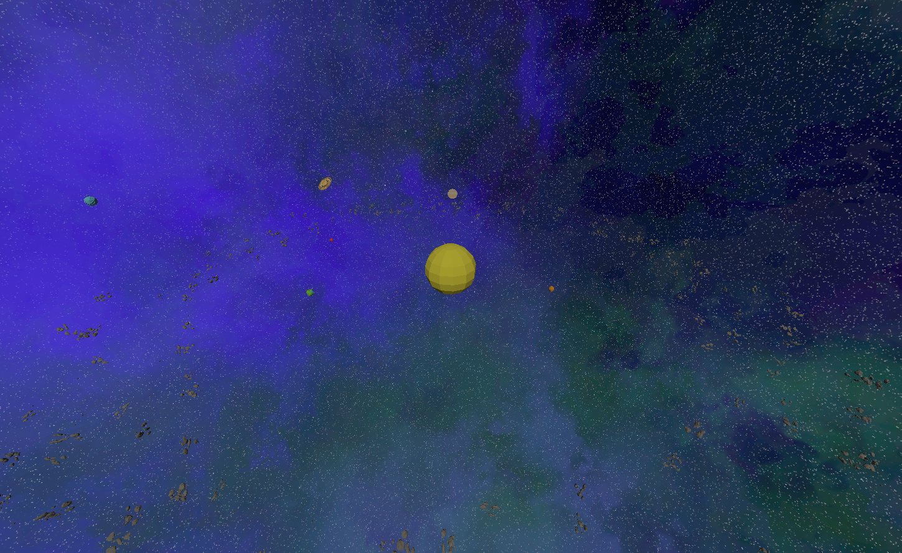
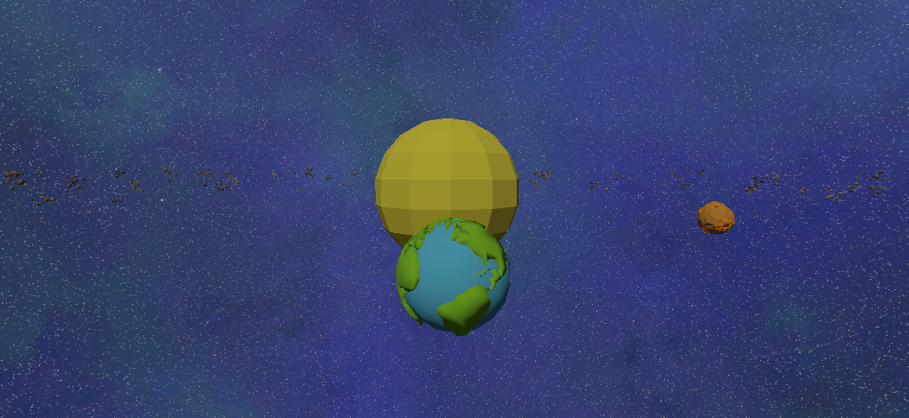
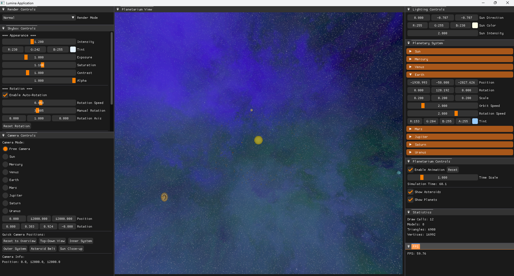
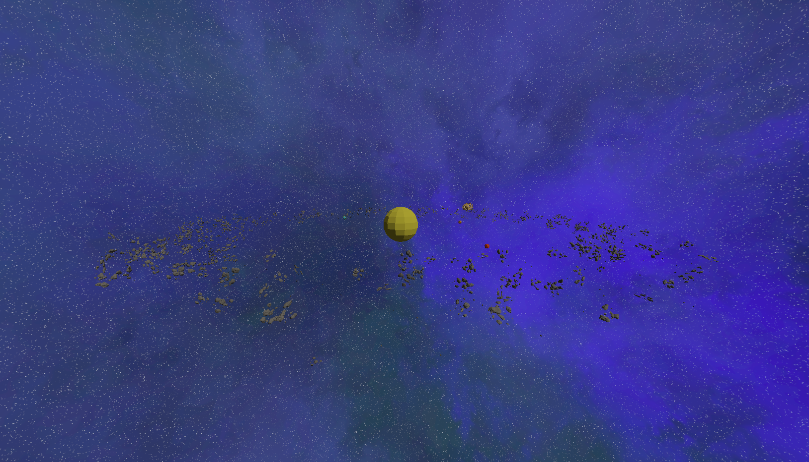
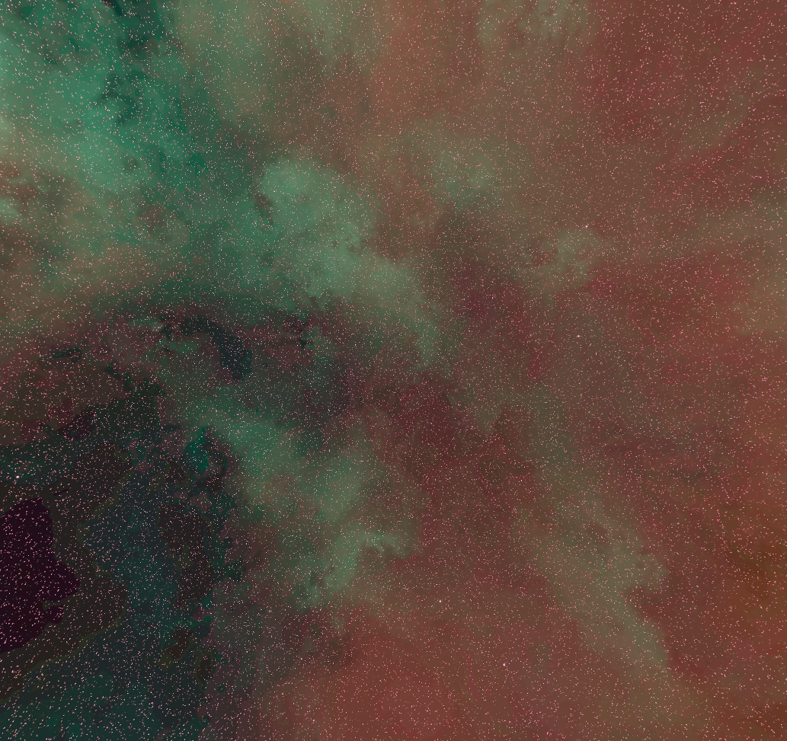
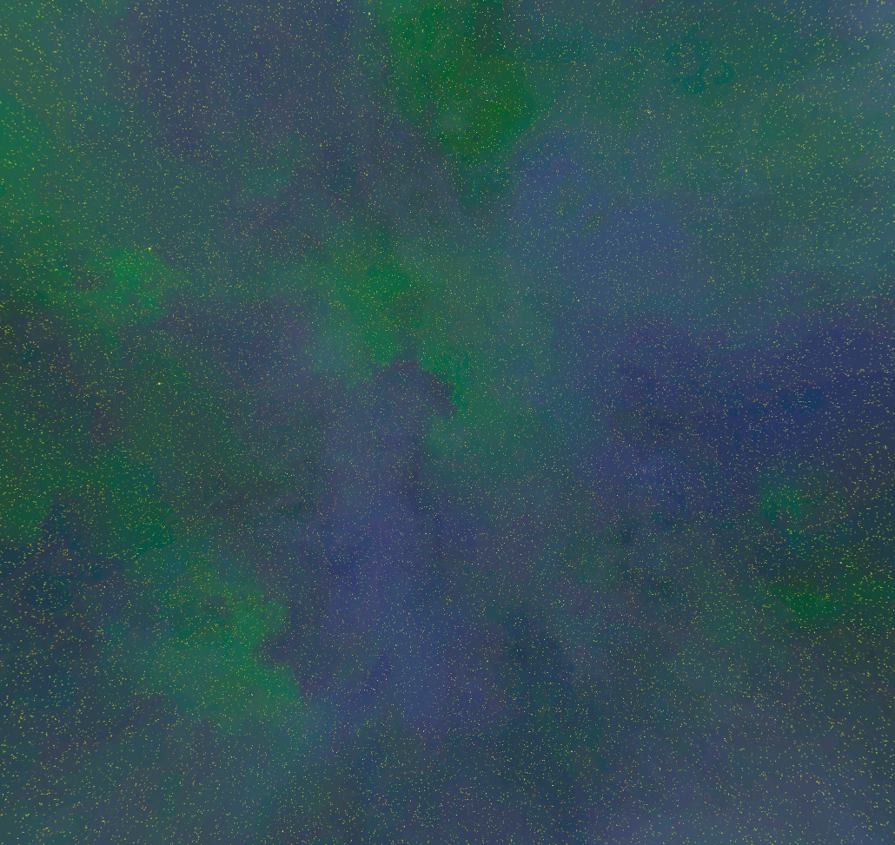
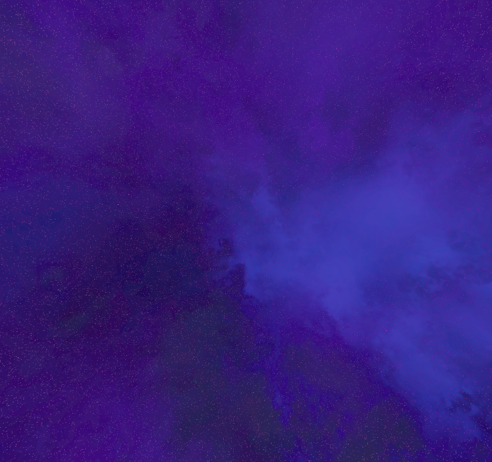
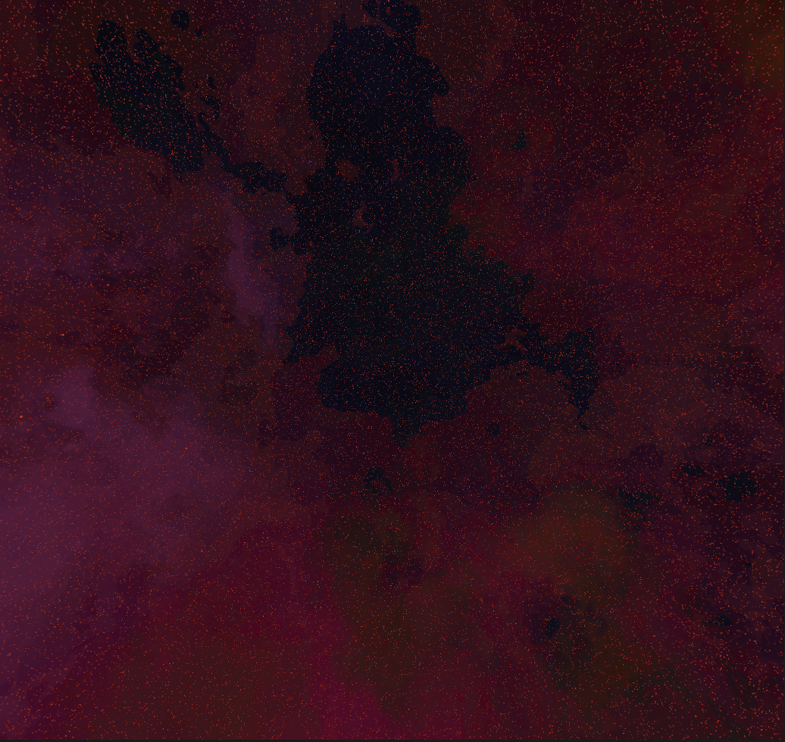

Orbital Engine
Orbital Engine is a 3D solar system simulation and planetarium application that provides an immersive, interactive experience for exploring celestial mechanics. Built with modern OpenGL rendering techniques, it features realistic planetary orbits, dynamic lighting, and comprehensive camera controls for educational and entertainment purposes. The engine showcases advanced 3D graphics programming while maintaining smooth performance and intuitive user interaction.

    
    
<em>Complete solar system view showing all planets in their orbits with realistic scaling</em>

🚀 Orbital Engine Features
✅ Real-time Solar System Simulation – Accurate planetary orbits with configurable time scaling and animation controls.
✅ Interactive Planetarium View – Immersive 3D environment with smooth navigation and exploration.
✅ Dynamic Camera System – Multiple camera modes including free-roam and planet-following with customizable parameters.
✅ Celestial Object Management – Individual planetary controls with orbit speed, rotation, and visual customization.
✅ Asteroid Belt Visualization – Detailed asteroid field rendering with toggle visibility controls.
✅ Advanced Lighting System – Realistic directional and point lighting with sun simulation.
✅ Performance Monitoring – Real-time FPS tracking and rendering statistics display.
🎨 Rendering Features
Orbital Engine leverages the Lumina rendering framework to provide cutting-edge 3D graphics capabilities:
Lumina Render Abstractions

Modern OpenGL Workflow – Streamlined 3D rendering pipeline with efficient GPU resource management
Model Registry System – Centralized 3D model loading and management for optimal memory usage
Advanced Shader Pipeline – Sophisticated lighting calculations with support for multiple light sources
Flexible Render Modes – Switch between Normal, Wireframe, and Point rendering for debugging and visualization

3D Workflow Integration

Perspective Camera System – Smooth 3D navigation with quaternion-based rotation and position controls
Skybox Rendering – Immersive space environment with customizable star fields and nebula effects
Real-time Statistics – Live monitoring of draw calls, triangle counts, and vertex processing
Viewport Management – Dynamic resolution scaling and responsive UI integration

    
    
<em>Close-up view of Jupiter showing detailed texturing and atmospheric effects</em>

🎨 Inspiration
Orbital Engine draws inspiration from educational planetarium software and space simulation games, aiming to create an accessible yet scientifically accurate representation of our solar system. The project showcases the capabilities of the Lumina rendering framework, which itself was inspired by TheCherno's Walnut engine architecture. The goal was to demonstrate advanced 3D graphics programming while creating an engaging tool for space exploration and education.
🔧 Technical Dependencies
Orbital Engine is built on top of the Lumina rendering framework and its associated dependencies:
Core Framework

Lumina – Custom 3D rendering and application framework providing OpenGL abstractions and scene management.

Lumina Dependencies

ImGui – Immediate mode GUI library for real-time control panels and debug interfaces.
GLFW – Cross-platform window management and input handling for OpenGL contexts.
Glad – OpenGL function loader managing API function pointers and extensions.
GLM – OpenGL Mathematics library providing vector and matrix operations optimized for graphics programming.

Additional Components

3D Model Loading – Support for various 3D model formats through Lumina's model registry system
Texture Management – Advanced texture loading and binding for planetary surfaces and space environments

    
    
<em>Wireframe rendering mode showing the underlying mesh structure of celestial bodies</em>

📥 Installation & Usage
🔧 Prerequisites

Windows OS (Windows 10 or higher recommended)
Visual Studio 2017 or higher with C++ development tools
OpenGL 3.3+ compatible graphics card
Git for repository cloning

🛠️ Setup Instructions

Clone the repository with all submodules and dependencies:
shgit clone --recursive https://github.com/stephen-os/OrbitalEngine.git

Navigate to the project directory and locate the scripts folder.
Run the appropriate setup script for your system to configure dependencies.
Open the generated .sln file in Visual Studio 2017 or later.
Set the configuration to Release for optimal performance.
Build and run the project from Visual Studio.

    
    
<em>Comprehensive control panels for camera, lighting, and simulation parameters</em>

🎨 How to Use
Getting Started

Launch the application to load the default solar system simulation.
The Planetarium View window displays the main 3D scene with all celestial bodies.
Use mouse controls to navigate:

Left Click + Drag – Rotate the camera view
Right Click + Drag – Pan the camera position
Scroll Wheel – Zoom in and out
Middle Mouse – Alternative camera control mode

Camera Controls
Navigate to the Camera Controls panel to access advanced viewing options:

Free Camera – Manual control over position and rotation
Planet Following – Automatically track specific planets with customizable distance and height
Quick Positions – Preset camera locations for optimal viewing angles:

Overview – Complete solar system perspective
Top-Down – Orbital plane view
Inner System – Focus on terrestrial planets
Outer System – Gas giants and outer planets
Asteroid Belt – Detailed asteroid field exploration
Sun Close-up – Solar observation mode

Simulation Controls
Use the Planetarium Controls panel to manage the simulation:

Enable Animation – Toggle real-time planetary motion
Time Scale – Adjust simulation speed from 0.1x to 5.0x
Reset – Return all planets to initial positions
Show Asteroids/Planets – Toggle visibility of celestial object types

Visual Customization
Access the Render Controls panel for visual options:

Normal Mode – Standard textured rendering
Wireframe Mode – Display mesh structure
Points Mode – Vertex-only visualization

Advanced Features

Lighting Controls – Adjust sun direction, color, and intensity
Planetary System – Individual planet controls for position, rotation, and orbital parameters
Skybox Controls – Customize space environment with intensity, tint, and rotation options
Statistics – Monitor rendering performance and resource usage

    
    
<em>Detailed asteroid belt rendering with thousands of individual asteroids</em>

⌨️ Keyboard Shortcuts

ESC – Exit application
F1 – Toggle help/controls overlay
SPACE – Pause/resume animation
R – Reset camera to overview position
1-9 – Quick switch to planet following mode
Mouse Wheel – Zoom in/out
Middle Mouse – Pan camera view

🚀 Potential Future Features

Realistic Physics – Gravitational interactions and n-body simulation
Mission Planning – Spacecraft trajectory calculation and visualization
Educational Mode – Interactive lessons and guided tours
VR Support – Immersive virtual reality experience
Custom Scenarios – User-defined solar system configurations
Exoplanet Systems – Exploration of distant star systems
Time-lapse Visualization – Long-term orbital evolution display

    

        
        
    

    

        
        
    

    
<em>Customizable space environments: Default space (top-left), Warm Galaxy (top-right), Cool Nebula (bottom-left), and Rotating Galaxy (bottom-right) presets</em>

📊 Performance Notes

Optimized for modern GPUs with OpenGL 3.3+ support
Efficient instanced rendering for asteroid fields
Level-of-detail system for distant objects
Configurable quality settings for various hardware capabilities

🔬 Technical Highlights

Modern C++ Architecture – Clean, maintainable codebase with proper abstraction layers
Component-Based Design – Modular system architecture for easy extension
Efficient Memory Management – Smart pointer usage and RAII principles
Cross-Platform Compatibility – Designed for portability across operating systems